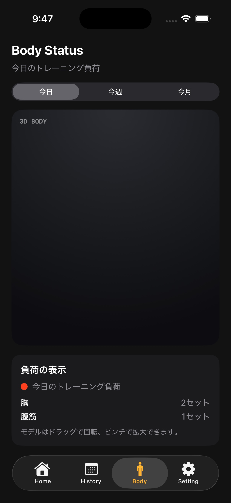

# Body 画面

## 目的

トレーニング履歴を部位別に集計し、今日・今週・今月の負荷を視覚的に確認する。

## 表示

- 共通ヘッダー「Body Status」
- 今日 / 今週 / 今月の期間切り替え
- 2D 部位マップまたは 3D 筋肉モデル
- 部位ごとのセット数・負荷状態
- 記録がない場合の未記録表示

## 集計

- 完了済み Workout のセットだけを対象にする。
- 選択期間に含まれるセットを部位グループごとに集計する。
- 同じ Workout に複数部位の種目があれば、それぞれの部位へ反映する。
- 期間を切り替えても保存データは変更しない。

## 3D モデル

`Body3DView.swift` が WKWebView と `BodyAnatomyLicensed.bundle` を橋渡しする。対象部位の Set を渡し、モデル側で筋肉グループをハイライトする。モデル読み込み中・利用できない場合は、2D 表示や空状態を妨げない設計にする。

## ライセンス表示

出典、CC BY-SA 4.0、加工内容、Three.js / Draco の notices は Setting と bundle 内に用意する。配布時は同梱素材ごとの条件を確認する。
