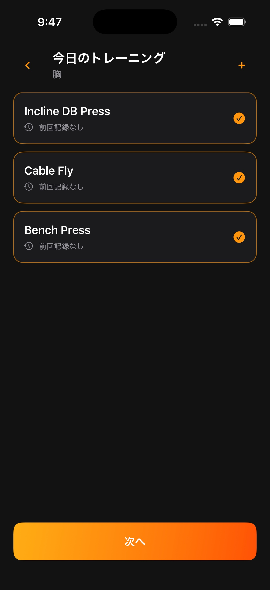

# 種目選択画面

## 目的

選択した部位に属する種目を確認し、Workout で記録する種目構成を確定する。



## 表示

- 共通の戻るボタンと「種目を選択」ヘッダー
- 部位ごとの種目リスト
- 選択中の種目表示
- 種目の追加・削除操作
- 下部固定の「次へ」ボタン

## 操作

- 種目行全体をタップして選択・解除する。
- 選択済みの種目は現在の順番を保つ。
- 「種目を追加」から新しい種目を作成し、そのまま今回の記録へ追加する。
- 不要な種目は今回の Workout から外す。種目マスタや過去履歴は削除しない。
- 1種目以上を選び、「次へ」で Workout を作成する。

## 入力と重複

- 同じ種目を同一 Workout に重複追加しない。
- 追加シートをキャンセルしても、確定済みの種目構成を変更しない。
- 種目名は空文字を許可しない。
- 同一部位・同一記録方法の同名種目は登録しない。

## 遷移

```text
部位選択 → 種目選択 → Workout
```

Workout から戻った場合は、この画面で種目を選び直せる状態を復元する。
