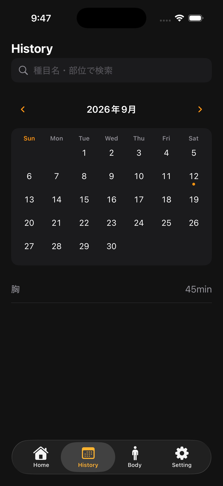

# History 画面

## 目的

過去のトレーニングをカレンダーと検索で見つけ、詳細確認・編集・削除を行う。

## 表示

- 共通ヘッダー「History」
- 種目名・部位の検索欄
- 月移動ボタン
- カレンダー（日ごとの記録有無）
- 選択日の記録一覧
- 記録がない場合の空状態

## 操作

- 前月 / 次月ボタンで表示月を変更する。
- カレンダーの日付をタップして、その日の記録だけに絞る。
- 検索欄へ種目名または部位を入力する。
- 記録行をタップして History 詳細を開く。
- 記録行を左へスワイプして削除する。

## 絞り込み

表示対象は、完了済みで1セット以上の記録があり、表示月・選択日・検索条件に一致する Workout。検索は日本語名、表示名、部位名を対象にする。

## 削除

削除前に確認ダイアログを表示する。削除対象は Workout と配下の種目・セットで、削除失敗時は画面上の一覧と SwiftData の状態を一致させる。

## 永続化

履歴は SwiftData の `Phase1Workout` と関連モデルから取得する。アプリを再起動しても、完了済みの履歴、編集内容、削除結果が保持される。
