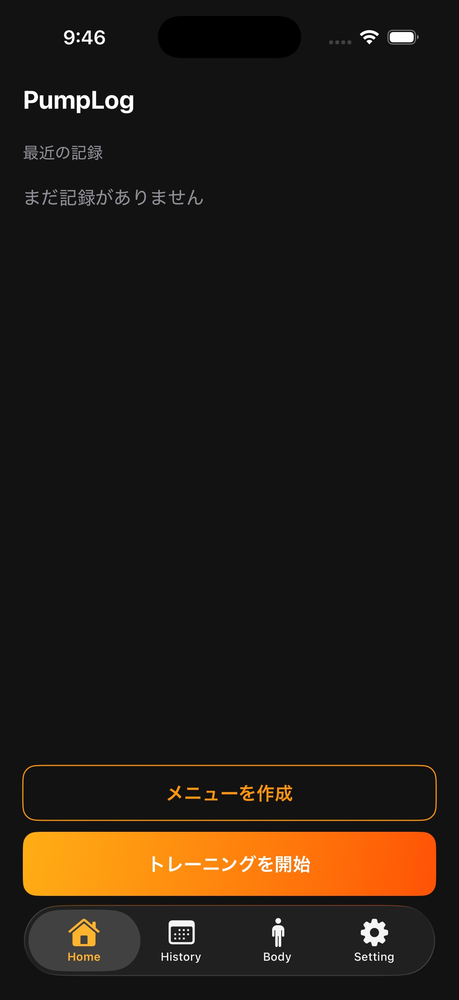

# Home 画面

## 目的

アプリ起動後の入口。トレーニング開始、進行中トレーニングの再開、保存済みメニューの利用、最近の記録の確認を一つの画面で行う。

## 表示

- 共通ヘッダー「PumpLog」
- 保存したメニューの一覧
- 各メニューの種目数と「開始」操作
- 最近の記録（最大3件）
- 下部固定の「メニューを作成」ボタン
- 下部固定の「トレーニングを開始」または「トレーニングに戻る」ボタン

## 操作

### トレーニング開始

- アクティブな Workout がない場合は、部位選択へ進む。
- アクティブな Workout がある場合は、保存済みの Workout を再開する。

### 保存済みメニュー

- 「開始」でメニュー内の種目をまとめて Workout に追加する。
- 行を左へスワイプ、または長押しメニューから削除する。
- 削除時は確認ダイアログを表示する。

### 状態

- アクティブな Workout が存在すると、開始ボタンは再開ボタンに変わる。
- Home タブへ戻ったときは古いナビゲーションを閉じ、再開操作を起点にする。
- 完了記録がない場合は「まだ記録がありません」を表示する。

## 保存

- メニューは `phase1TrainingTemplates` として UserDefaults に JSON 保存する。
- Workout と最近の記録は SwiftData から取得する。
- メニュー名は前後の空白を除去し、空の名前や種目なしでは保存しない。

## 操作上の注意

開始ボタンとメニュー作成ボタンは画面下部に固定する。長い記録一覧をスクロールしても主要操作が隠れないことを優先する。
