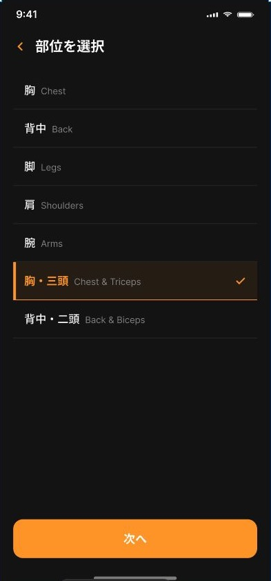

# 部位選択画面

## 目的

今回のトレーニングで鍛える部位を選び、次の種目選択画面へ渡す。

## 表示

- 共通の戻るボタンと「部位を選択」ヘッダー
- 胸、背中、肩、腕、脚、腹筋などの部位行
- 日本語名と英語名
- 選択中のオレンジ表示とチェックマーク
- 下部固定の「次へ」ボタン
- 部位の追加・非表示を行う「編集」操作

## 操作

- 部位行全体をタップして選択・解除する。
- 複数部位を同時に選択できる。後から選んだ部位が以前の選択を置き換えない。
- 「次へ」は1部位以上が選択されている場合に進める。
- 戻る、または画面を閉じた場合は選択内容を次画面へ確定しない。

## 状態

選択状態は `Phase1MuscleSelectionViewModel.selected` の Set で管理する。複合部位の行は、その行に含まれる全部の部位が選択されている場合に選択中として扱う。

## 編集

部位編集では、ユーザー定義の部位追加と不要な部位の非表示を扱う。既存の履歴を壊さないため、部位を非表示にしても過去記録は削除しない。

## アクセシビリティ

- 行全体をタップ領域にする。
- 選択中 / 未選択をアクセシビリティ値で伝える。
- 「次へ」「戻る」「部位を追加・削除」に明示的なラベルを付ける。
