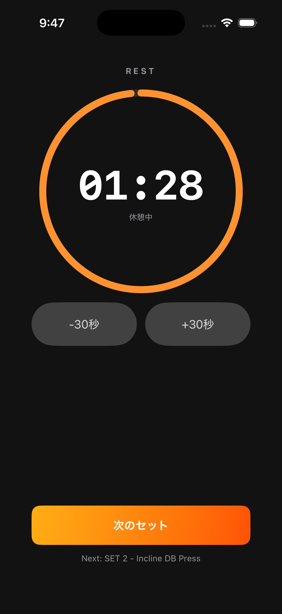

# 休憩タイマー

## 目的

セット完了後の休憩時間を管理し、次のセットへ移るタイミングを知らせる。トレーニング中の画面遷移と入力を止めないことを優先する。

タイマーの実装状態は上のキャプチャで確認できます。

## 表示

- 残り時間を大きく表示
- 残り時間に応じたオレンジの進捗表示
- 「−30秒」「＋30秒」ボタン
- 秒数表示をタップして編集できる領域
- 「次のセット」ボタン

## 操作

- セット完了後に自動開始する。
- 秒数表示をタップすると分・秒を編集できる。
- −30秒 / ＋30秒で休憩時間を変更する。
- 0秒になった後も、＋30秒でタイマーを再開できる。
- 「次のセット」で休憩を終了し、入力画面へ戻る。

## 実装ルール

- 表示は `TimelineView` を使って滑らかに更新する。
- 永続化する終了時刻は `Phase1Workout.restEndAt`。
- 残り時間は 0〜600 秒にクランプする。
- タイマー終了時は一度だけ振動し、音は鳴らさない。
- 振動の有無は Setting の `phase1RestHapticsEnabled` に従う。

## 中断と復元

画面を離れても、終了時刻が未来なら残り時間を再計算する。タイマーが終了済みなら 0 秒で表示し、＋30秒操作で新しい終了時刻を設定する。

## アクセシビリティ

- タイマー全体に「休憩タイマー」のラベルを付ける。
- 秒数表示に「休憩時間を分単位で編集」というヒントを付ける。
- −30秒、＋30秒、次のセットを個別に読み上げ可能にする。
