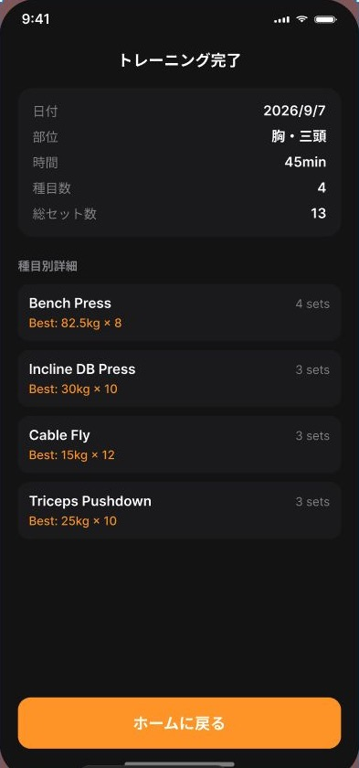

# Result 画面

## 目的

完了したトレーニングの概要と自己ベストを確認し、Home または履歴へ戻る。

## 表示

- トレーニング日（例：2026/8/9）
- 対象部位
- 所要時間
- 種目数
- 総セット数
- 種目ごとの記録概要
- 更新された自己ベスト（Weight PR / Rep PR）
- 「ホームに戻る」操作

## 完了データ

Workout の完了時刻を `endedAt` に保存し、開始時刻との差から所要時間を算出する。`completedAt` があるセットだけを総セット数と PR の対象にする。

## 操作

- 結果を確認したら「ホームに戻る」で Home のルートを初期化する。
- 完了済みデータは History と Body の集計へ反映される。
- Result での表示確認だけでは履歴データを変更しない。

## 不整合防止

完了条件を満たさない Workout は Result を作成しない。保存に失敗した場合は完了扱いにせず、再試行できる状態を維持する。
