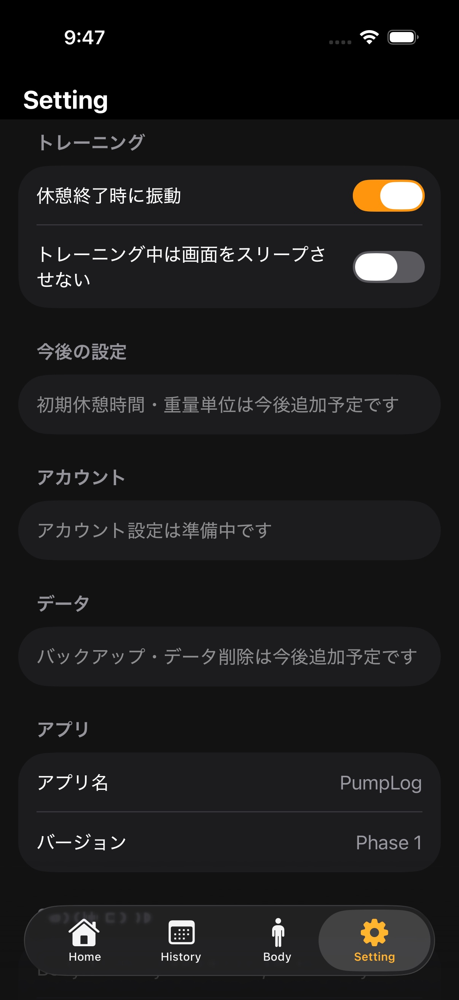

# Setting 画面

3D人体モデルの出典・ライセンスは、[専用の説明ページ](../3d-model-license.md)を参照してください。

## 目的

トレーニング中の補助設定と、アプリ・3Dモデルに関する情報を確認する。

## 表示と操作

### トレーニング

- 「休憩終了時に振動」
- 「トレーニング中は画面をスリープさせない」

どちらも Toggle で即時反映する。設定値は `@AppStorage` に保存し、再起動後も維持する。

### 今後の設定

初期休憩時間、重量単位などの追加予定項目を表示する。未実装項目は操作できるように見せず、準備中であることを明示する。

### アカウント・データ

アカウント設定、バックアップ、データ削除は現時点では準備中。実装する場合は、削除範囲と復元方法を明確にした確認フローを追加する。

### アプリ情報

アプリ名と現在のバージョン（Phase 1）を表示する。

### 3D人体モデル

モデルの出典、ライセンスリンク、帰属、改変内容、関連ライブラリの notices を表示する。
