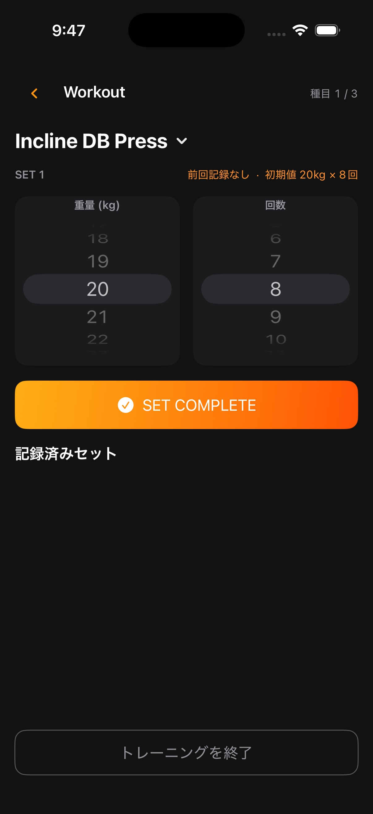

# Workout 画面

## 目的

トレーニング中に、種目ごとのセットを最少操作で記録する。入力中の状態はアクティブ Workout として保存し、途中再開に対応する。

状態別の挙動は、実装画面を操作して確認できます。上のキャプチャは記録入力中の状態です。

## 表示

- Workout ヘッダーと現在の種目名
- 種目切り替え用のタブ
- 前回記録の表示
- 重量・回数のホイールピッカー
- 「SET COMPLETE」ボタン
- 記録済みセット一覧
- 種目の追加・削除・切り替え操作
- 下部固定の「トレーニング終了」ボタン

## セット記録

1. 種目タブを選ぶ。
2. 重量と回数を設定する。
3. 「SET COMPLETE」をタップする。
4. `Phase1WorkoutSet` を作成し、セット番号を採番する。
5. 休憩タイマーを開始する。

重量・回数は、セット完了時に範囲を検証する。重量は 0〜500 kg、回数は 1〜100 回。回数のみの種目では重量を保存しない。

## 前回値

完了済みの最新 Workout から、同じ種目・同じセット番号の値を初期表示する。同じ番号がなければ、その種目の最後のセットを使う。過去記録がない場合は重量 20 kg、回数 8 回を表示する。

## セット編集・削除

- 既存セットをタップして重量・回数を編集する。
- 削除は確認操作を経て実行する。
- 削除後はセット番号を詰め直す。
- 保存失敗時はモデルと画面の状態を一致させ、エラーを表示する。

## 種目操作

- 種目タブをタップして入力対象を切り替える。
- 種目追加で現在の Workout に種目を追加する。
- 種目削除後、選択中 ID がなくなった場合は残りの先頭種目を選択する。
- Workout から戻ると、種目選択画面へ戻って構成を変更できる。

## 終了

- セット一覧だけをスクロールし、終了ボタンは下部に固定する。
- 終了時は保存済みセットを検証し、完了条件を満たす場合だけ `completed` に変更する。
- 完了後は Result へ遷移する。
- 未入力種目や無効値がある場合は保存せず、修正を促す。

## 復元

`Phase1WorkoutRecoveryService` がアクティブ Workout を検索する。アプリ再起動後や Home への復帰時も、保存済みのセット、選択種目、休憩終了時刻を復元する。
